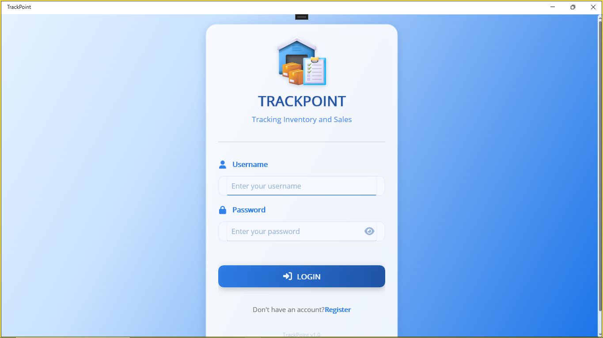
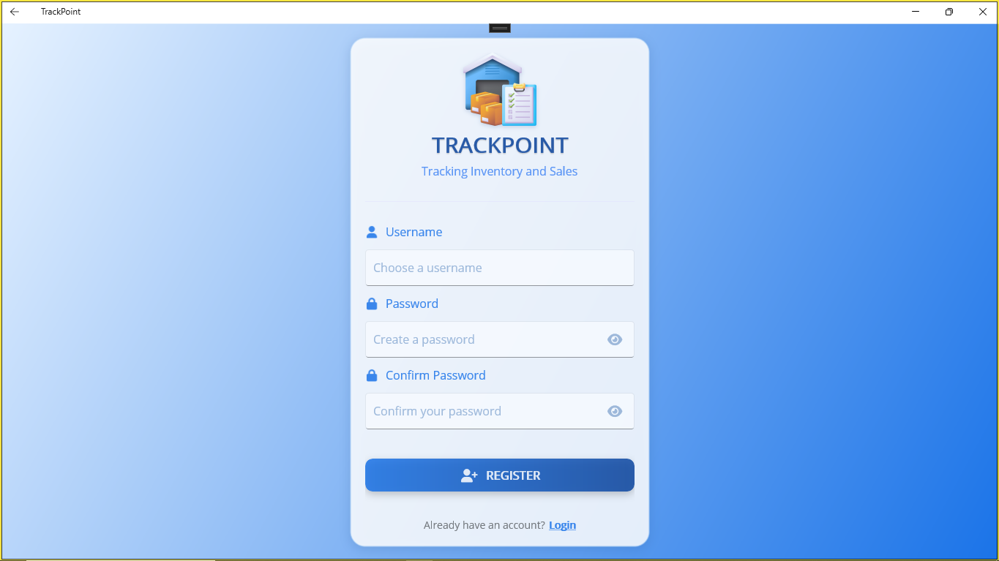
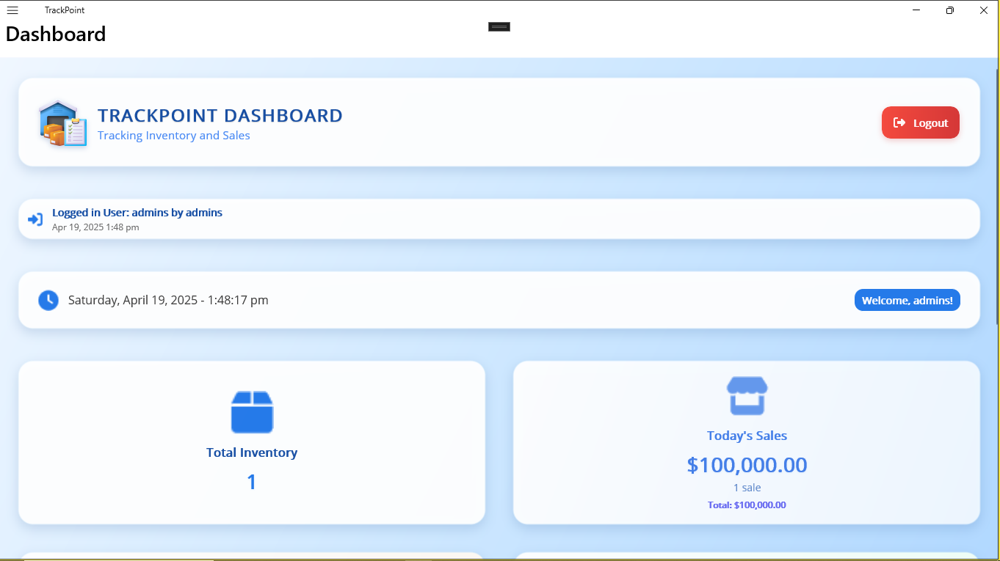
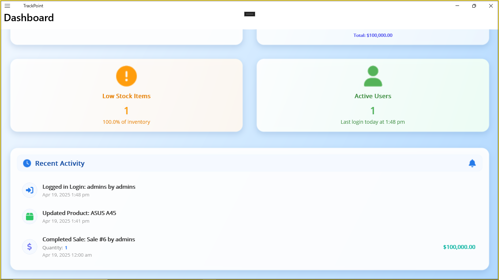
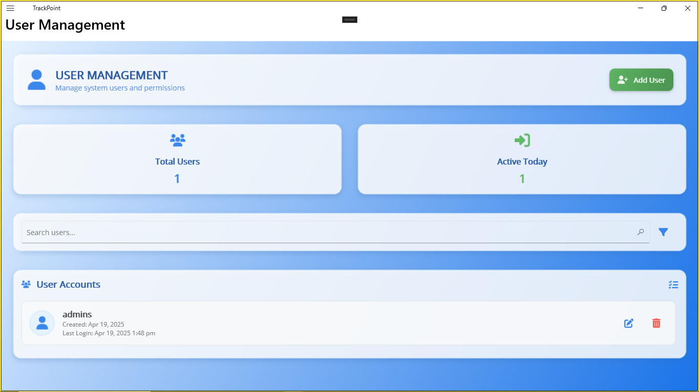
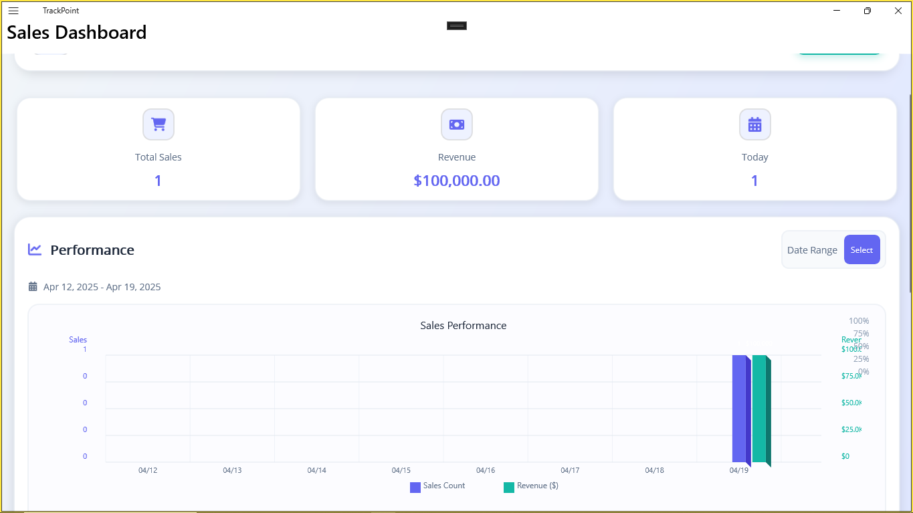
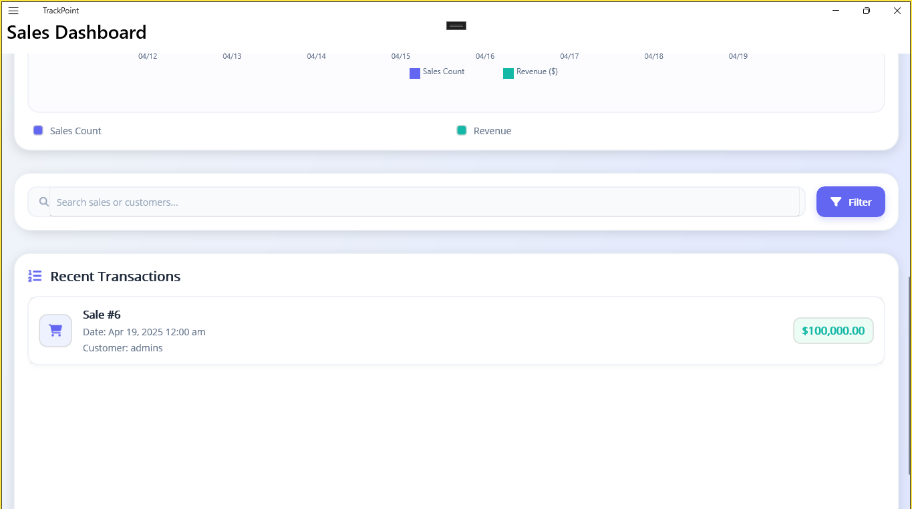
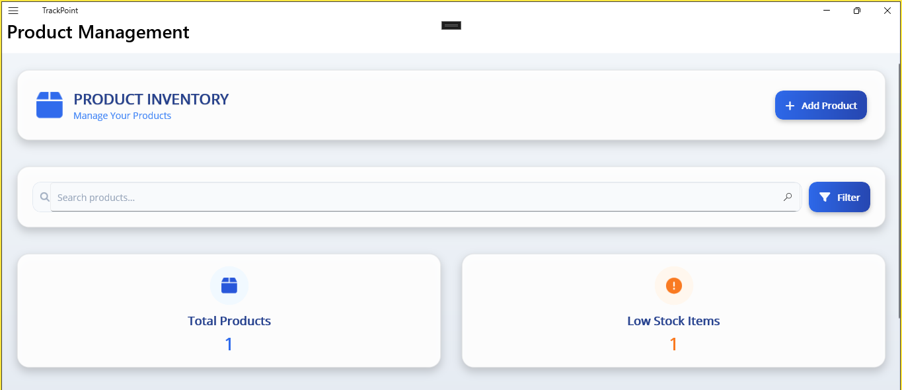
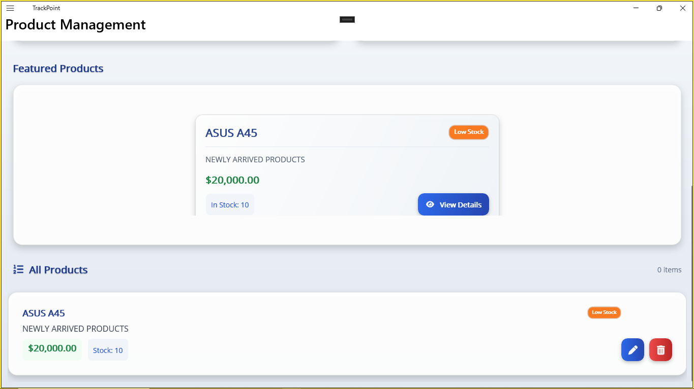

# TrackPointV

<div align="center">
  
  <h3>Comprehensive Inventory and Sales Management System</h3>
</div>

## Overview

TrackPointV is a powerful point-of-sale (POS) and inventory management application built with .NET MAUI. It provides businesses with tools to efficiently track inventory, manage products, process sales, and analyze performance metrics in a modern, responsive cross-platform interface.

## Features

### Inventory Management
- **Product Tracking**: Easily add, edit, and manage product information including price, description, and stock levels
- **Low Stock Alerts**: Visual indicators for products below threshold stock levels
- **Categorization**: Organize products for efficient inventory management
- **Search & Filter**: Quickly locate products using search functionality or filters

### Sales Processing
- **Intuitive POS Interface**: User-friendly interface for processing sales transactions
- **Receipt Generation**: Create and print professional sales receipts
- **Customer Management**: Track customer information and purchase history
- **Payment Processing**: Support for multiple payment methods

### Reporting & Analytics
- **Sales Dashboard**: Visual overview of sales performance and trends
- **Inventory Reports**: Track stock levels, product turnover, and valuation
- **Revenue Analysis**: Break down revenue by time periods, products, or categories
- **Export Functionality**: Export reports in various formats

### User Management
- **Role-Based Access**: Control system access with customizable user roles
- **Secure Authentication**: Keep your business data safe with login security
- **Activity Logging**: Track user actions within the system

## Getting Started

### System Requirements
- Windows 10/11
- .NET 6.0 or later
- SQL Server (Express version supported)
- Minimum 4GB RAM, 2GHz processor

### Installation

1. Clone the repository:
   ```
   git clone https://github.com/yourusername/TrackPointV.git
   ```

2. Open the solution in Visual Studio 2022

3. Configure the database:
   - Navigate to the Connection folder
   - Double-click the .MDF file
   - Right-click > Properties > Copy the ConnectionString
   - Open Service Folder > Connection.cs
   - Update the ConnectionString with your copied value

4. Build and run the application

## Configuration Options

### Database Connection
To change the database connection string:
1. Open the Connection folder
2. Double-click the .MDF file
3. Right-click > Properties > Copy the ConnectionString
4. Open Service folder > Connection.cs
5. Replace the existing connection string

### User Authentication
The default admin credentials are:
- Username: admin
- Password: admin

*Important: Change these credentials after first login for security purposes*

## Screenshots

<div align="center">
  
  <p><em>Secure login interface for user authentication</em></p>
  
  
  <p><em>User registration form for creating new system accounts</em></p>
  
  
  <p><em>Main dashboard with key metrics and navigation options</em></p>
  
  
  <p><em>Extended dashboard view with additional analytics</em></p>
  
  
  <p><em>User management interface for controlling access and permissions</em></p>
  
  
  <p><em>Sales dashboard showing revenue metrics and transaction history</em></p>
  
  
  <p><em>Detailed sales analytics and transaction processing tools</em></p>
  
  
  <p><em>Product inventory management with stock levels and categories</em></p>
  
  
  <p><em>Detailed product information and inventory controls</em></p>
</div>

## Architecture

TrackPointV is built using:
- **.NET MAUI**: For cross-platform UI development
- **C#**: Core business logic implementation
- **SQL Server**: Database backend for data storage
- **MVVM Pattern**: For clean separation of concerns

## License

This project is licensed under the MIT License - see the LICENSE file for details.

## Support

For support, feature requests, or bug reports, please open an issue on the GitHub repository or contact the development team at support@trackpointv.com.

## Contributing

Contributions are welcome! Please feel free to submit a Pull Request.

1. Fork the project
2. Create your feature branch (`git checkout -b feature/AmazingFeature`)
3. Commit your changes (`git commit -m 'Add some AmazingFeature'`)
4. Push to the branch (`git push origin feature/AmazingFeature`)
5. Open a Pull Request

---

<div align="center">
  <p>Developed with ❤️ by TrackPointV Team</p>
</div>
